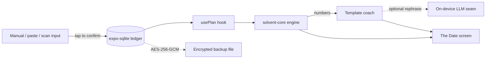

<div align="center">


# Solvent

### Your debt-free date, figured out on your phone. Nothing ever leaves it.

[](https://github.com/aashir-athar/solvent/stargazers)
[](https://github.com/aashir-athar/solvent/network/members)
[](https://github.com/aashir-athar/solvent/issues)
[](LICENSE)
[](https://github.com/aashir-athar/solvent/commits)
[](https://expo.dev)
[](https://reactnative.dev)
[](https://www.typescriptlang.org)
[](https://github.com/aashir-athar/solvent)

</div>

Solvent is a privacy-first, on-device personal finance app that computes one number you can feel: the exact date you become debt-free. You type, paste, or scan your balances; a deterministic, open-source TypeScript engine works out the date and a month-by-month plan; an on-device coach explains it in plain language. No bank login. No cloud. No account. Nothing leaves the phone.

---

## Architecture decisions (read first)

| Decision | Choice | Why |
|---|---|---|
| Brief | Compute and show one outcome: the debt-free / goal date, then coach it | One screen to nail, one engine to test, one moment to feel |
| Backend | None | The promise is structural: there are no servers to send data to |
| Engine | `solvent-core`, pure dependency-free TypeScript, integer minor units, no system clock inside | Reproducible, auditable, unit-tested to death; the open-core trust anchor |
| Coach | Deterministic templater that only rephrases engine numbers, with an optional on-device LLM rephrase seam (Apple Foundation Models / Gemini Nano) that degrades to the templater | Language from the model, numbers from the engine, zero model risk |
| Data | `expo-sqlite` (the ledger) + Zustand persisted via AsyncStorage (settings, entitlement, language) | Local-first, no account |
| State | Zustand. No React Query (there is no network to cache) | Right-sized, honest |
| Styling | `@mindees/tokens` + `@mindees/icons` + `StyleSheet`; one token-driven source of truth | On-brand, no hardcoded palette |
| Navigation | Expo Router in `src/app/`, `NativeTabs` from `expo-router/unstable-native-tabs` | Real platform tab bar |
| Backup | Opt-in AES-256-GCM encrypted file you control (`@noble/ciphers`, PBKDF2 key) | Encrypted backup with no server |
| Monetization | Paywall + entitlement seam (RevenueCat drop-in) | Full UX, swappable billing |

---

## Demo

<div align="center">

| Light | Dark | The plan |
|---|---|---|
|  |  |  |

</div>

> Screenshots are captured from a device build. Generate the app icon and illustrations from `assets/icon-prompts.md`.

---

## Table of contents

- [Why Solvent?](#why-solvent)
- [Features](#features)
- [Tech stack](#tech-stack)
- [Architecture](#architecture)
- [Design philosophy](#design-philosophy)
- [Getting started](#getting-started)
- [Scripts](#scripts)
- [Roadmap](#roadmap)
- [Contributing](#contributing)
- [FAQ](#faq)
- [Acknowledgments](#acknowledgments)
- [License](#license)

---

## Why Solvent?

Money anxiety is universal, felt every month, and fast to act on. Yet every mainstream budgeting app links your bank through a US-centric aggregator, which is a trust barrier for many and a hard technical barrier for the roughly 1.4 billion adults who have no bank-rail API at all. Solvent serves anyone with a phone. It is a private budget app with no bank login, an offline debt payoff planner, and a debt-free date calculator, all running on-device. It works in Karachi, Lagos, Jakarta, and Sao Paulo exactly as well as in San Francisco, because it needs nothing but your phone.

Long-tail terms this project covers: react native expo SDK 56 finance app, on-device debt payoff calculator, avalanche vs snowball planner, privacy-first budgeting open source, offline-first expo-sqlite zustand example, react-native-reanimated FlashList finance app.

---

## Features

- Compute the exact debt-free or savings-goal date from balances you enter, paste, or scan.
- Move the date with a live what-if slider that only ever shows true outcomes from the engine.
- Pay off debt by avalanche, snowball, or a custom order, with full minimum-payment rollover.
- See your work: a month-by-month schedule where every figure can be audited.
- Understand the date in plain language from an on-device coach that never invents a number.
- Keep everything private: no account, no cloud, no bank login, ever.
- Back up to one encrypted file only your passphrase can open.
- Read your statement on-device: paste text now, photo scanning via the documented dev-client module.
- Switch among six languages (English, Urdu, Hindi, Arabic, Indonesian, Portuguese) with right-to-left support.

---

## Tech stack

| Category | Tool | Why |
|---|---|---|
| Framework | Expo SDK 56, React Native 0.85, New Architecture | One codebase, native-parity startup |
| Language | TypeScript (strict, `noUncheckedIndexedAccess`) | Correctness the compiler enforces |
| Engine | `solvent-core` (plain TS, MIT) | Deterministic, dependency-free, open-core |
| Navigation | Expo Router + `unstable-native-tabs` | File-based routes, real platform tab bar |
| State | Zustand + AsyncStorage persist | Lightweight, local-first |
| Local store | expo-sqlite | The on-device ledger |
| Animation | react-native-reanimated v4 + worklets | 120 fps on the UI thread |
| Lists | @shopify/flash-list | Smooth long lists |
| Design tokens | @mindees/tokens + @mindees/icons | Token-driven, on-brand |
| Forms | react-hook-form + zod | Fast, validated |
| Crypto | @noble/ciphers + @noble/hashes | Audited AES-256-GCM backup |
| Fonts | Sora, Inter, JetBrains Mono | Feeling, reading, proof |

---

## Architecture

The whole product is the verified-safe 2026 pattern: deterministic code for every number, an on-device language layer that only phrases those numbers, and a human in the loop on every categorization. Nothing calls out.



```
solvent/
|- src/
|  |- app/                 # Expo Router routes (SDK 56 location)
|  |  |- (tabs)/           # NativeTabs: Date, Goals, Add, Insights, Privacy
|  |  |- onboarding.tsx  plan.tsx  why.tsx  paywall.tsx  backup.tsx  scan.tsx  settings.tsx
|  |  |- debt/            # add + edit modals
|  |- core/solvent-core/  # the open-core engine + tests (MIT)
|  |- components/          # design-system primitives + cohesive icon set
|  |- features/           # coach, backup, ocr, debts, paywall
|  |- hooks/              # usePlan, useMilestones, useCoachMessage
|  |- stores/             # Zustand: debts, settings, entitlement
|  |- db/                 # SQLite database + debts repository
|  |- i18n/               # 6-language dictionaries + engine
|  |- theme/              # tokens, spruce accent, provider
|  |- lib/  schemas/
|- assets/                # icon-prompts.md, images, fonts
|- eas.json  tsconfig.json  README.md  zero-to-deploy.md
```

---

## Design philosophy

- Engineering: the math is deterministic, integer-only, and unit-tested with a 1000-case property test. A wrong number in a money app is trust-fatal, so the number is always reproducible.
- Design: one calm, premium-restraint lane (Linear and Things grade) with a single locked spruce accent. The emotional date renders in a warm display face; every audited figure renders in monospace tabular numerals. Feeling versus proof, made literal.
- Psychology: the Date screen is built on the peak-end rule, the what-if slider on honest agency, and milestones on loss aversion that only ever appears when progress is real. No dark patterns.

---

## Getting started

Prerequisites: Node 20+, the Expo tooling, and Xcode or Android Studio for device builds.

```bash
git clone https://github.com/aashir-athar/solvent.git
cd solvent
npm install
npx expo start
```

- iOS: press `i` (a dev client is required for native modules; see `zero-to-deploy.md`).
- Android: press `a`.
- Run the engine tests: `npx jest`.

---

## Scripts

| Script | What it does |
|---|---|
| `npx expo start` | Start the dev server |
| `npm run android` | Open on Android |
| `npm run ios` | Open on iOS |
| `npm run web` | Open the web target |
| `npx jest` | Run the unit + property tests |
| `npx tsc --noEmit` | Type-check in strict mode |
| `npx expo-doctor` | Check dependency health |

---

## Roadmap

- [x] Deterministic payoff engine (avalanche, snowball, custom) with golden + property tests
- [x] The Date home, what-if slider, show-your-work plan, why-this-date
- [x] On-device coach with optional LLM rephrase seam
- [x] Encrypted opt-in backup and restore
- [x] Statement parser, milestones, six-language localization
- [ ] Native on-device LLM coach wired in a dev client (Apple Foundation Models / Gemini Nano)
- [ ] Photo statement scanning via a dev-client text recognizer
- [ ] Realtime end-to-end-encrypted multi-device sync
- [ ] Corridor packs: localized statement formats and currencies

---

## Contributing

First-time contributors very welcome. There is a [`good first issue`](https://github.com/aashir-athar/solvent/labels/good%20first%20issue) label specifically for you. The single highest-leverage place to help is `src/core/solvent-core`: add golden test cases, support more payoff strategies, or sharpen the statement parser.

- Commits follow [Conventional Commits](https://www.conventionalcommits.org).
- Branch naming: `feat/...`, `fix/...`, `chore/...`.
- Open a pull request against `main` with a clear description and screenshots for UI changes.

<div align="center">


</div>

---

## FAQ

<details>
<summary>How does Solvent compute my debt-free date?</summary>

A deterministic TypeScript engine (`solvent-core`) simulates each month: it accrues interest, pays every minimum, then pours your spare amount into one debt by your chosen strategy and rolls the freed minimums forward as debts close. It returns the exact payoff date plus a month-by-month schedule. The math is open source, so you can verify it.

</details>

<details>
<summary>Does Solvent connect to my bank?</summary>

No. There is no bank login and no aggregator. You type, paste, or scan your balances. The app has no servers, so there is nothing to breach.

</details>

<details>
<summary>Is my data uploaded anywhere?</summary>

No. Your ledger lives in a private SQLite database on the device, and your settings live in local storage. A backup, if you make one, is an AES-256-GCM encrypted file that only your passphrase can open, saved wherever you choose.

</details>

<details>
<summary>What is avalanche versus snowball?</summary>

Avalanche sends every spare dollar to the highest-rate debt first, which costs the least interest. Snowball clears your smallest balance first, which gives an early win that many people find easier to sustain. Solvent shows both, side by side, in Insights.

</details>

<details>
<summary>Which languages does Solvent support?</summary>

English, Urdu, Hindi, Arabic, Indonesian, and Portuguese, with right-to-left layout for Arabic and Urdu. Switch in Settings.

</details>

---

## Acknowledgments

Built on the work of [Expo](https://expo.dev), [React Native](https://reactnative.dev), [Reanimated](https://docs.swmansion.com/react-native-reanimated/), [FlashList](https://shopify.github.io/flash-list/), [Zustand](https://github.com/pmndrs/zustand), [Noble cryptography](https://paulmillr.com/noble/), and the `@mindees` design system.

---

## License

MIT. See [LICENSE](LICENSE).

<div align="center">

**Aashir Athar**

[](https://github.com/aashir-athar)
[](https://www.linkedin.com/in/aashirathar/)
[-aashirathar-000000?style=for-the-badge&logo=x&logoColor=white)](https://x.com/aashirathar)

</div>

<!--
Repo About: Privacy-first, on-device debt-free-date calculator. No bank login, no cloud. Open-source money math.
Topics: react-native, expo, expo-sdk-56, typescript, personal-finance, debt-payoff, debt-free, on-device, privacy, local-first, offline-first, fintech, zustand, react-native-reanimated, flashlist, expo-router, expo-sqlite, mobile-app, ios, android
Homepage: https://github.com/aashir-athar/solvent
-->
